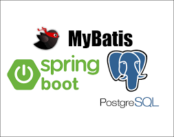

# mybatis-demo



This is sample application to demonstrate how to integrate `MyBatis` with Spring Boot.

### Tools

* Java 17
* Spring Boot
* MyBatis 3.0.2
* PostgreSQL 15.4 (psql --version)

### Dependency

```
<dependency>
    <groupId>org.mybatis.spring.boot</groupId>
    <artifactId>mybatis-spring-boot-starter</artifactId>
    <version>3.0.2</version>
</dependency>
```

## MyBatis

MyBatis is a Java persistence framework that couples objects with SQL statements or stored procedures using an XML
descriptor or annotations.

<details>
<summary><b>Key Terminologies</b></summary>

1. **Mapper Interface:**
   A Java interface that defines the SQL statements to be executed. Each method in the interface corresponds to a SQL
   statement.
2. **Mapper XML File:**
   An XML file that provides the SQL mappings for the methods defined in the Mapper Interface. It contains SQL
   statements and mapping information between Java objects and database tables.
3. **Result Map:**
   A configuration in MyBatis that defines how the result of a database query is mapped to a Java object. Result Maps
   specify the relationships between the database columns and the fields in Java objects.
4. **Parameter Map:**
   A configuration in MyBatis that defines how the input parameters for a SQL statement are mapped to the parameters in
   the SQL statement.
5. **SqlSession:**
   A session object that acts as a bridge between Java code and database operations. It provides methods for executing
   SQL statements, loading mappers, and managing transactions.
6. **SqlSessionFactory:**
   An interface responsible for creating SqlSession objects. It is typically configured once during application startup
   and used to create SqlSession instances.
7. **SqlSessionFactoryBuilder:**
   A class responsible for creating SqlSessionFactory instances from XML configuration or Java-based configuration. It
   is used to bootstrap the MyBatis framework.
8. **Dynamic SQL:**
   The ability to construct SQL queries dynamically based on runtime conditions. MyBatis provides features
   like <if>, <choose>, <when>, <otherwise>, and <foreach> to build dynamic SQL queries.
9. **Type Handlers:**
   Components responsible for mapping Java types to JDBC types. MyBatis provides a set of built-in type handlers, and
   you can also create custom type handlers if needed.
10. **Lazy Loading:**
    A technique in which data is loaded from the database only when it is accessed for the first time in the
    application. MyBatis supports lazy loading for associations and collections.
11. **Association and Collection Properties:**
    In MyBatis, you can define relationships between objects using association and collection properties. These
    properties define how related objects are loaded and mapped.
12. **Caching:**
    MyBatis supports caching to improve performance by storing the results of database queries in memory. You can
    configure caching at the statement level or globally for mappers.

</details>

### Create Table Script 

```
CREATE SEQUENCE IF NOT EXISTS departments_id_seq;

CREATE TABLE departments
(
   id bigint NOT NULL DEFAULT nextval('departments_id_seq') PRIMARY KEY,
   name VARCHAR(255) NOT NULL,
   code VARCHAR(255) NOT NULL
);


CREATE SEQUENCE IF NOT EXISTS employees_id_seq;

CREATE TABLE employees
(
   id bigint NOT NULL DEFAULT nextval('employees_id_seq') PRIMARY KEY,
   first_name VARCHAR(255) NOT NULL,
   last_name VARCHAR(255) NOT NULL,
   email_address VARCHAR(255) NOT NULL,
   department_id bigint,
   FOREIGN KEY (department_id) REFERENCES departments(id)
);
```